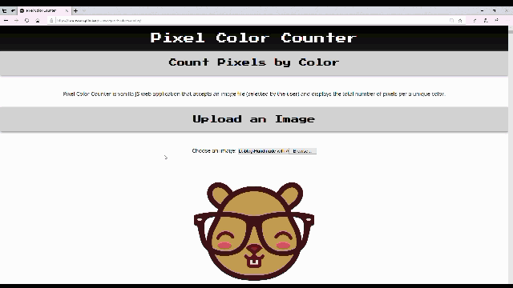
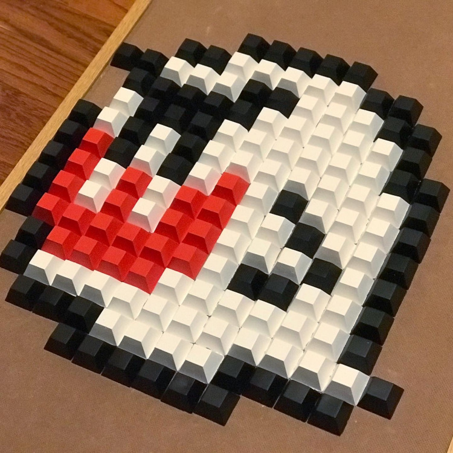

# canvas-pixel-color-counter
A web app that counts the number of pixels in an image per a unique color. See it in action [here](http://townsean.github.io/canvas-pixel-color-counter)! (work in progress)

## Synopsis
Canvas Pixel Color Counter is a vanilla JS web application that accepts an image file (selected by the user) and displays the total number of pixels per a unique color. 

## Motivation
I love making [geeky 8-bit art](https://www.ashleygrenon.com/tag/8-bit/) (mostly from wood). Part of the tedius process is counting the number of pixels per color. I wanted to automate the process, so I created [a Python script](https://www.thecodingcouple.com/counting-pixels-by-color-in-python-with-pillow-a-pil-fork/) do the job. You can [view the source for it here](https://github.com/townsean/pixel-color-count).

The script works great for my use case, but I wanted to make it more accessible for others out there that may have a similar need. To do that I needed to move away from an application that ran on the command line to something that ran in the browser with a nice user interface.

Since this is a rather simple web app that [mostly utilizies the HTML5 canvas](https://developer.mozilla.org/en-US/docs/Web/API/Canvas_API/Tutorial/Pixel_manipulation_with_canvas), I decided to write it using vanilla JS and CSS.

## Built With

* [Press Start 2P Google Font](https://fonts.google.com/specimen/Press+Start+2P)
* [Open Sans Google Font](https://fonts.google.com/specimen/Open+Sans)

## Useful Resources
* [Using files from web applications](https://developer.mozilla.org/en-US/docs/Web/API/File/Using_files_from_web_applications)
* [Pixel manipulation with canvas](https://developer.mozilla.org/en-US/docs/Web/API/Canvas_API/Tutorial/Pixel_manipulation_with_canvas)
* [Drawing images onto canvas](https://webplatform.github.io/docs/concepts/programming/drawing_images_onto_canvas/)

## Maintainers

* [Ashley Grenon - @townsean](https://github.com/townsean)

## License (MIT)

The MIT License (MIT) Copyright (c) 2019 Ashley Grenon

Permission is hereby granted, free of charge, to any person obtaining a copy of this software and associated documentation files (the "Software"), to deal in the Software without restriction, including without limitation the rights to use, copy, modify, merge, publish, distribute, sublicense, and/or sell copies of the Software, and to permit persons to whom the Software is furnished to do so, subject to the following conditions:

The above copyright notice and this permission notice shall be included in all copies or substantial portions of the Software.

THE SOFTWARE IS PROVIDED "AS IS", WITHOUT WARRANTY OF ANY KIND, EXPRESS OR IMPLIED, INCLUDING BUT NOT LIMITED TO THE WARRANTIES OF MERCHANTABILITY, FITNESS FOR A PARTICULAR PURPOSE AND NONINFRINGEMENT. IN NO EVENT SHALL THE AUTHORS OR COPYRIGHT HOLDERS BE LIABLE FOR ANY CLAIM, DAMAGES OR OTHER LIABILITY, WHETHER IN AN ACTION OF CONTRACT, TORT OR OTHERWISE, ARISING FROM, OUT OF OR IN CONNECTION WITH THE SOFTWARE OR THE USE OR OTHER DEALINGS IN THE SOFTWARE.

